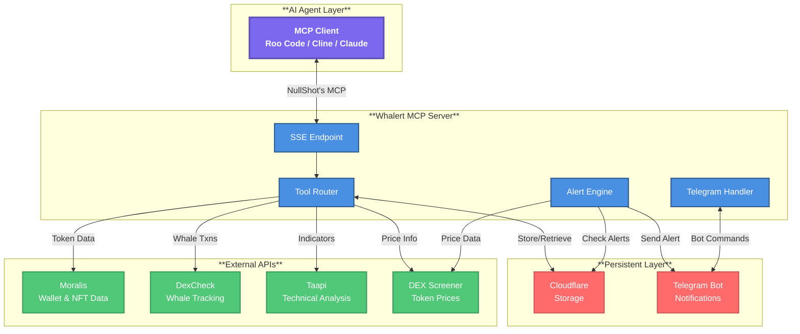

# Whalert

A professional MCP server providing real-time blockchain data access, comprehensive token analysis, and automated price alerts via Telegram. All tools utilize free APIs suitable for personal usage.

## Usage Examples for simplicity

### Setting Up Price Alerts

```
Set a price alert for PEPE when it reaches $0.000001
```

The system will:
1. Search for PEPE token
2. Show you matching options
3. Confirm your selection
4. Monitor price every 5 minutes
5. Send Telegram notification when target is reached

### Analyzing Tokens

```
Analyze BTC/USDT on 1h timeframe
```

### Checking Wallet Activity

```
Show me the token balance for wallet 0x742d35Cc6634C0532925a3b844Bc9e7595f0bEb
```

### Tracking Whale Movements

```
Show me recent whale transactions over $100,000
```

## Architecture Overview



## Features

### Available Tools

| Tool | Description |
|------|-------------|
| **tokenPriceAlert** | Set up price alerts with Telegram notifications for specific tokens |
| **tokenAnalyzer** | Technical analysis using RSI, MACD, EMA, Bollinger Bands, and more |
| **tokenSecurityChecker** | Comprehensive security audit for token contracts (honeypot detection, ownership risks) |
| **tokenSearchAndInfo** | Search tokens by name/symbol and retrieve metadata (price, market cap, DEX info) |
| **whaleTracker** | Monitor large whale transactions across ETH and BSC chains |
| **transactionTracker** | Decode transaction hashes into human-readable format |
| **getWalletTokenBalance** | Check token holdings across multiple chains (ETH, Avalanche, BSC) |
| **getWalletTokenTransactions** | Retrieve recent transaction history for any wallet |
| **getNFTByWallet** | View NFT collections owned by a wallet address |
| **getFearAndGreed** | Get current crypto market sentiment index |

## Prerequisites

### Required API Keys

| API Key | Used By | Get It From |
|---------|---------|-------------|
| `MORALIS_API_KEY` | transactionTracker, getWalletTokenTransactions, getWalletTokenBalance, getNFTByWallet | [moralis.io](https://moralis.io) |
| `DEXCHECK_API_KEY` | whaleTracker | [dexcheck.ai](https://dexcheck.ai) |
| `TAAPI_API_KEY` | tokenAnalyzer | [taapi.io](https://taapi.io) |
| `TGBOT_TOKEN` | tokenPriceAlert (Telegram notifications) | [@BotFather](https://t.me/BotFather) on Telegram |

## Setup Guide

### 1. Get Your Telegram Bot Token

1. Open Telegram and search for [@BotFather](https://t.me/BotFather)
2. Send `/newbot` command
3. Follow the prompts to create your bot
4. Copy the token provided (format: `123456:ABC-DEF1234ghIkl-zyx57W2v1u123ew11`)
5. Get your Chat ID:
   - Send `/start` to the deployed bot (after setting webhook, etc.)
   - Copy the Chat ID number provided

### 2. Configure API Keys

#### For Local Development

Create a `.dev.vars` file in the project root:

```env
MORALIS_API_KEY=your_moralis_key_here
DEXCHECK_API_KEY=your_dexcheck_key_here
TAAPI_API_KEY=your_taapi_key_here
TGBOT_TOKEN=your_telegram_bot_token_here
```

#### For Production Deployment

Use Wrangler secrets for secure storage:

```bash
npx wrangler secret put MORALIS_API_KEY
npx wrangler secret put DEXCHECK_API_KEY
npx wrangler secret put TAAPI_API_KEY
npx wrangler secret put TGBOT_TOKEN
```

### 3. Deploy or Run Locally

#### Local Development

```bash
npx wrangler dev
```

#### Production Deployment

```bash
npx wrangler deploy
```

After deployment, note your worker URL (e.g., `https://your-worker.workers.dev`)

### 4. Configure Telegram Webhook

Set up the webhook so your bot can receive commands. Replace `<YOUR_BOT_TOKEN>` and `<YOUR_WORKER_URL>` with your actual values:

```
https://api.telegram.org/bot<YOUR_BOT_TOKEN>/setWebhook?url=<YOUR_WORKER_URL>/telegram-webhook
```

**Example:**
```
https://api.telegram.org/bot123456:ABC-DEF1234ghIkl-zyx57W2v1u123ew11/setWebhook?url=https://blockchain-mcp.workers.dev/telegram-webhook
```

Open this URL in your browser. You should see:
```json
{"ok":true,"result":true,"description":"Webhook was set"}
```

### 5. Test Your Bot

Send `/start` to your bot on Telegram. You should receive a welcome message with your Chat ID.

## MCP Configuration

### Roo Code / etc.

Add to your MCP settings configuration:

```json
{
  "mcpServers": {
    "whalert": {
      "type": "sse",
      "url": "https://your-worker.workers.dev/sse",
      "alwaysAllow": [
        "tokenPriceAlert",
        "confirmTokenAlert",
        "cancelAlert",
        "getWalletTokenTransactions",
        "getWalletTokenBalance",
        "transactionTracker",
        "whaleTracker",
        "tokenAnalyzer",
        "tokenSecurityChecker",
        "tokenSearchAndInfo",
        "getFearAndGreed",
        "getNFTByWallet"
      ],
      "timeout": 300
    }
  }
}
```

## Complete Tools Reference

### Available Tools with Parameters

| Tool | Description | Parameters | Required | Default |
|------|-------------|------------|----------|---------|
| **tokenPriceAlert** | Sets up price alerts with Telegram notifications for specific tokens | `searchQuery` - Token name, symbol, or contract address<br/>`alertType` - Type: "price_above", "price_below", "percent_change"<br/>`targetValue` - Target price (USD) or percentage<br/>`telegramChatId` - Your Telegram chat ID | All required | - |
| **confirmTokenAlert** | Confirms and activates a price alert after token selection | `tokenChoice` - Token number (1-5) from list<br/>`pairAddress` - Pair address of chosen token<br/>`tokenAddress` - Contract address<br/>`tokenSymbol` - Token symbol<br/>`tokenName` - Token name<br/>`chainId` - Blockchain network<br/>`currentPrice` - Current USD price<br/>`alertType` - Alert type<br/>`targetValue` - Target value<br/>`telegramChatId` - Telegram chat ID | All required | - |
| **cancelAlert** | Cancels an active price alert by its ID | `alertId` - Alert ID to cancel<br/>`telegramChatId` - Chat ID for confirmation | All Required | - |
| **tokenAnalyzer** | Technical analysis using RSI, MACD, EMA, Bollinger Bands, etc. | `symbol` - Trading pair (e.g., BTC/USDT)<br/>`interval` - Timeframe: 1m, 5m, 15m, 30m, 1h, 2h, 4h, 12h, 1d, 1w | All required | - |
| **tokenSecurityChecker** | Comprehensive security audit for token contracts | `contractAddress` - Token contract address (0x...)<br/>`chainId` - Chain ID (1=Ethereum, 56=BSC, etc.) | `contractAddress` required | chainId: 1 |
| **tokenSearchAndInfo** | Search tokens and retrieve metadata (price, market cap, DEX info) | `searchQuery` - Token name or symbol | Required | - |
| **whaleTracker** | Monitor large whale transactions across ETH and BSC chains | `minUsd` - Minimum USD value for transactions<br/>`page` - Page number for pagination | None required | minUsd: 10000<br/>page: 1 |
| **transactionTracker** | Decode transaction hashes into human-readable format | `txHash` - Transaction hash (starts with 0x)<br/>`chain` - Blockchain: eth, bsc, polygon, avalanche, fantom, arbitrum, optimism | `txHash` required | chain: eth |
| **getWalletTokenBalance** | Check token holdings across multiple chains | `walletAddress` - Wallet address (0x...)<br/>`minValue` - Minimum USD value to include | `walletAddress` required | minValue: 1 |
| **getWalletTokenTransactions** | Retrieve recent transaction history (last 5) for any wallet | `walletAddress` - Wallet address (0x...)<br/>`chain` - Chain: eth, avalanche, bsc (checks all if not provided) | `walletAddress` required | - |
| **getNFTByWallet** | View NFT collections owned by a wallet address | `walletAddress` - Wallet address (0x...)<br/>`chain` - Chain: eth, sepolia, polygon, bsc, arbitrum, base, optimism, avalanche, etc. | All required | - |
| **getFearAndGreed** | Get current crypto market sentiment index (0-100 scale) | None | - | - |

### Supported Chains by Tool

**getWalletTokenBalance / getWalletTokenTransactions:**
- Ethereum (eth)
- Avalanche (avalanche)
- Binance Smart Chain (bsc)
- Monad (monad)

**getNFTByWallet:**
- eth, sepolia, holesky, polygon, amoy, bsc, bsc testnet, arbitrum, base, base sepolia, optimism, linea, linea sepolia, avalanche, fantom, cronos, gnosis, gnosis testnet, chiliz, chiliz testnet, moonbeam, moonriver, moonbase, flow, flow-testnet, ronin, ronin-testnet, lisk, lisk-sepolia, pulse, sei, sei-testnet, monad

**tokenSecurityChecker Chain IDs:**
- 1 = Ethereum
- 56 = BSC
- 42161 = Arbitrum
- 137 = Polygon
- 324 = zkSync
- 59144 = Linea
- 8453 = Base
- 534352 = Scroll
- 10 = Optimism
- 43114 = Avalanche
- 250 = Fantom
- 25 = Cronos
- And more (see full list in documentation)

**transactionTracker:**
- eth, bsc, polygon, avalanche, fantom, arbitrum, optimism

**whaleTracker:**
- Ethereum (ETH)
- Binance Smart Chain (BSC)

## Telegram Bot Commands

| Command | Description |
|---------|-------------|
| `/start` | Display welcome message and get your Chat ID |
| `/myalerts` | View all active price alerts with current prices |
| `/refresh` | Manually trigger alert check for all monitored tokens |

## Price Alert Monitoring

- Alerts are checked every **5 minutes** via Cloudflare cron trigger
- Automatic notifications sent to Telegram when conditions are met
- Alerts are automatically removed after triggering
- Supports multiple alert types: price_above, price_below, percent_change


*Built with Nullshot's TypeScript MCP Framework.*
