# Whalert

A professional MCP server providing real-time blockchain data access, comprehensive token analysis, and automated price alerts via Telegram. All tools utilize free APIs suitable for personal usage.


## Features

### Available Tools

| Tool | Description |
|------|-------------|
| **tokenPriceAlert** | Set up price alerts with Telegram notifications for specific tokens |
| **tokenAnalyzer** | Technical analysis using RSI, MACD, EMA, Bollinger Bands, and more |
| **tokenSecurityChecker** | Comprehensive security audit for token contracts (honeypot detection, ownership risks) |
| **tokenSearchAndInfo** | Search tokens by name/symbol and retrieve metadata (price, market cap, DEX info) |
| **whaleTracker** | Monitor large whale transactions across ETH and BSC chains |
| **transactionTracker** | Decode transaction hashes into human-readable format |
| **getWalletTokenBalance** | Check token holdings across multiple chains (ETH, Avalanche, BSC) |
| **getWalletTokenTransactions** | Retrieve recent transaction history for any wallet |
| **getNFTByWallet** | View NFT collections owned by a wallet address |
| **getFearAndGreed** | Get current crypto market sentiment index |

## Prerequisites

### Required API Keys

| API Key | Used By | Get It From |
|---------|---------|-------------|
| `MORALIS_API_KEY` | transactionTracker, getWalletTokenTransactions, getWalletTokenBalance, getNFTByWallet | [moralis.io](https://moralis.io) |
| `DEXCHECK_API_KEY` | whaleTracker | [dexcheck.ai](https://dexcheck.ai) |
| `TAAPI_API_KEY` | tokenAnalyzer | [taapi.io](https://taapi.io) |
| `TGBOT_TOKEN` | tokenPriceAlert (Telegram notifications) | [@BotFather](https://t.me/BotFather) on Telegram |

## Setup Guide

### 1. Get Your Telegram Bot Token

1. Open Telegram and search for [@BotFather](https://t.me/BotFather)
2. Send `/newbot` command
3. Follow the prompts to create your bot
4. Copy the token provided (format: `123456:ABC-DEF1234ghIkl-zyx57W2v1u123ew11`)
5. Get your Chat ID:
   - Send `/start` to the deployed bot (after setting webhook, etc.)
   - Copy the Chat ID number provided

### 2. Configure API Keys

#### For Local Development

Create a `.dev.vars` file in the project root:

```env
MORALIS_API_KEY=your_moralis_key_here
DEXCHECK_API_KEY=your_dexcheck_key_here
TAAPI_API_KEY=your_taapi_key_here
TGBOT_TOKEN=your_telegram_bot_token_here
```

#### For Production Deployment

Use Wrangler secrets for secure storage:

```bash
npx wrangler secret put MORALIS_API_KEY
npx wrangler secret put DEXCHECK_API_KEY
npx wrangler secret put TAAPI_API_KEY
npx wrangler secret put TGBOT_TOKEN
```

### 3. Deploy or Run Locally

#### Local Development

```bash
npx wrangler dev
```

#### Production Deployment

```bash
npx wrangler deploy
```

After deployment, note your worker URL (e.g., `https://your-worker.workers.dev`)

### 4. Configure Telegram Webhook

Set up the webhook so your bot can receive commands. Replace `<YOUR_BOT_TOKEN>` and `<YOUR_WORKER_URL>` with your actual values:

```
https://api.telegram.org/bot<YOUR_BOT_TOKEN>/setWebhook?url=<YOUR_WORKER_URL>/telegram-webhook
```

**Example:**
```
https://api.telegram.org/bot123456:ABC-DEF1234ghIkl-zyx57W2v1u123ew11/setWebhook?url=https://blockchain-mcp.workers.dev/telegram-webhook
```

Open this URL in your browser. You should see:
```json
{"ok":true,"result":true,"description":"Webhook was set"}
```

### 5. Test Your Bot

Send `/start` to your bot on Telegram. You should receive a welcome message with your Chat ID.

## MCP Configuration

### Roo Code / etc.

Add to your MCP settings configuration:

```json
{
  "mcpServers": {
    "whalert": {
      "type": "sse",
      "url": "https://your-worker.workers.dev/sse",
      "alwaysAllow": [
        "tokenPriceAlert",
        "confirmTokenAlert",
        "cancelAlert",
        "getWalletTokenTransactions",
        "getWalletTokenBalance",
        "transactionTracker",
        "whaleTracker",
        "tokenAnalyzer",
        "tokenSecurityChecker",
        "tokenSearchAndInfo",
        "getFearAndGreed",
        "getNFTByWallet"
      ],
      "timeout": 300
    }
  }
}
```

## Architecture Overview

```mermaid
graph TB
    subgraph Client["AI Agent Layer"]
        A[MCP Client<br/>Roo Code / Cline / Claude]
    end
    
    subgraph Server["Whalert MCP Server"]
        B[SSE Endpoint]
        C[Tool Router]
        D[Alert Engine]
        E[Telegram Handler]
    end
    
    subgraph APIs["🌐 External APIs"]
        F[Moralis<br/>Wallet & NFT Data]
        G[DexCheck<br/>Whale Tracking]
        H[Taapi<br/>Technical Analysis]
        I[DEX Screener<br/>Token Prices]
    end
    
    subgraph Storage["💾 Persistent Layer"]
        J[Cloudflare KV<br/>Alert Storage]
        K[Telegram Bot<br/>Notifications]
    end
    
    A <-->|MCP Protocol| B
    B --> C
    C -->|Token Data| F
    C -->|Whale Txns| G
    C -->|Indicators| H
    C -->|Price Info| I
    C <-->|Store/Retrieve| J
    D -->|Check Alerts| J
    D -->|Price Data| I
    D -->|Send Alert| K
    E <-->|Bot Commands| K
    
    classDef clientStyle fill:#7B68EE,stroke:#5D4FB3,stroke-width:3px,color:#fff,font-weight:bold
    classDef serverStyle fill:#4A90E2,stroke:#2E5C8A,stroke-width:2px,color:#fff
    classDef apiStyle fill:#50C878,stroke:#3A9B5C,stroke-width:2px,color:#fff
    classDef storageStyle fill:#FF6B6B,stroke:#CC5555,stroke-width:2px,color:#fff
    
    class A clientStyle
    class B,C,D,E serverStyle
    class F,G,H,I apiStyle
    class J,K storageStyle
```


## Usage Examples for simplicity

### Setting Up Price Alerts

```
Set a price alert for PEPE when it reaches $0.000001
```

The system will:
1. Search for PEPE token
2. Show you matching options
3. Confirm your selection
4. Monitor price every 5 minutes
5. Send Telegram notification when target is reached

### Analyzing Tokens

```
Analyze BTC/USDT on 1h timeframe
```

### Checking Wallet Activity

```
Show me the token balance for wallet 0x742d35Cc6634C0532925a3b844Bc9e7595f0bEb
```

### Tracking Whale Movements

```
Show me recent whale transactions over $100,000
```

## Telegram Bot Commands

| Command | Description |
|---------|-------------|
| `/start` | Display welcome message and get your Chat ID |
| `/myalerts` | View all active price alerts with current prices |
| `/refresh` | Manually trigger alert check for all monitored tokens |

## Price Alert Monitoring

- Alerts are checked every **5 minutes** via Cloudflare cron trigger
- Automatic notifications sent to Telegram when conditions are met
- Alerts are automatically removed after triggering
- Supports multiple alert types: price_above, price_below, percent_change


*Built with Nullshot's typescript mcp framework.*